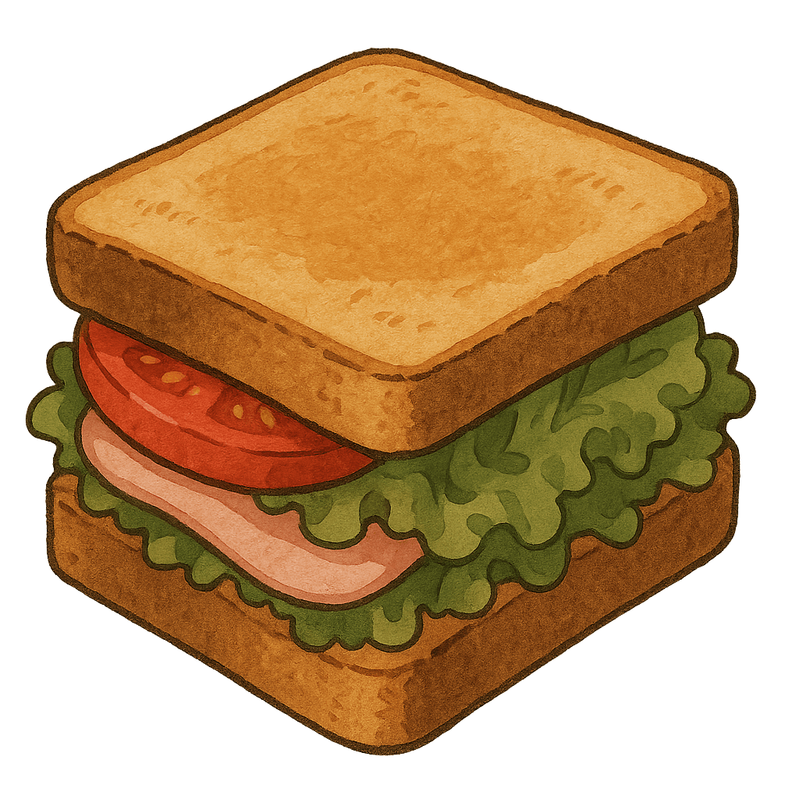

# Sandwish



Create and share your dream sandwich with the world! Sandwish is a fun web application that lets you build virtual sandwiches by stacking different ingredients, name your creation, and share it with others through a unique URL.

## Features

- 🥪 Stack ingredients to build your perfect sandwich
- ✏️ Name your creation
- 🎨 Beautiful, playful UI with smooth animations
- 🔗 Share your sandwich with a unique URL
- 📱 Fully responsive design

## Development

This project is built with:

- [Vite](https://vitejs.dev/) - Next Generation Frontend Tooling
- [TypeScript](https://www.typescriptlang.org/) - JavaScript with syntax for types
- [Netlify](https://www.netlify.com/) - For hosting and serverless functions

### Prerequisites

- [Node.js](https://nodejs.org/) (v16 or higher)
- [npm](https://www.npmjs.com/) (usually comes with Node.js)

### Local Setup

1. Clone the repository:

   ```bash
   git clone https://github.com/yourusername/sandwish.git
   cd sandwish
   ```

2. Install dependencies:

   ```bash
   npm install
   ```

3. Start the development server:

   ```bash
   npm run dev
   ```

4. Open your browser and visit:
   ```
   http://localhost:5173
   ```

### Building for Production

To create a production build:

```bash
npm run build
```

The built files will be in the `dist` directory.

## Deployment

This project is configured for deployment on Netlify. Simply push to your repository and Netlify will automatically build and deploy your site.

## License

This project is licensed under the MIT License - see the [LICENSE](LICENSE) file for details.
